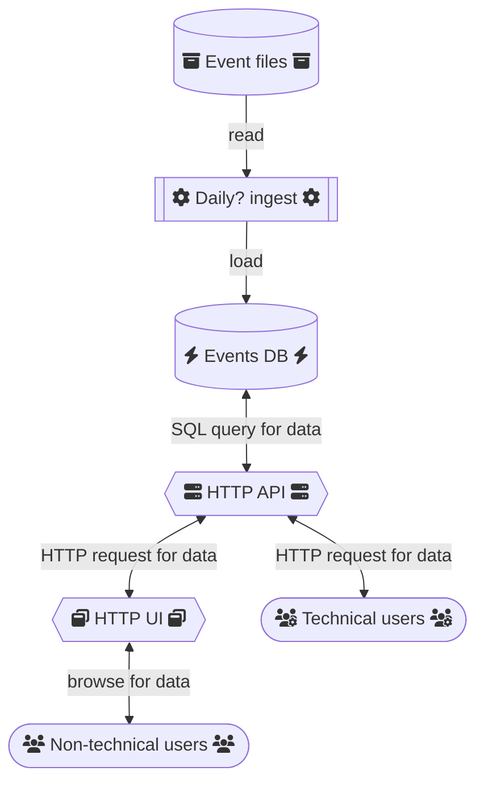

# AROSS Stations database

This project aims to provide an interface to spatially and temporally search
measurements from AROSS observation stations and visualize the results on a map or bar
chart.

## Architecture

These components will be developed in the order they are listed. If the link is broken,
we haven't got to it yet :)

* [aross-stations-db](https://github.com/nsidc/aross-stations-db): A PostGIS database
  indexed by space and time.
  * Is loaded from measurements in files on disk. There are 1.8 million events from
    1923-present.
  * We will likely limit our database to 2000-present.
  * Will need to be updated with new data as it comes in.
  * _Does not_ need to be backed up because the database isn't the source of truth; it
    can instead be re-initialized from source data.
* [aross-stations-api](https://github.com/nsidc/aross-stations-api): Sits on top of the
  database and allows _programmatically_ searching events by various facets, most
  importantly space (bbox, polygon) and time.
  * Can be used by writing Python, `wget`, `curl`, or other programmatic tools.
  * Returns data in machine-readable format.
* [aross-stations-ui](https://github.com/nsidc/aross-stations-ui): Sits on top of the
  API and allows non-technical users to search events in the browser.
  * Visualizes event locations and total count for each station on a map.
  * Visualizes event frequency on a bar plot.

